# Use Case Views

This document shows who uses the LaPrizza information system and which business capabilities are available to each actor in Sprint 1, plus the Sprint 2 user stories with use cases of their own (WEB04, WEB06, WEB07, AA01, AA02, AA04, AA07, VIS01, VIS02, VIS05, VIS06, AI06). The system is treated as a black box: only actors and use cases are represented, with no internal components.

- [Use Case Views](#use-case-views)
  - [Actors](#actors)
  - [Use Cases Diagram](#use-cases-diagram)
  - [User Stories](#user-stories)
    - [BCK01: User and Authentication Management](#bck01-user-and-authentication-management)
      - [Flow Mapping](#flow-mapping)
    - [BCK02: Customer Management](#bck02-customer-management)
      - [Flow Mapping](#flow-mapping-1)
    - [BCK03: Product Category Management](#bck03-product-category-management)
      - [Flow Mapping](#flow-mapping-2)
    - [BCK04: Allergen Management](#bck04-allergen-management)
      - [Flow Mapping](#flow-mapping-3)
    - [BCK05: Product Management](#bck05-product-management)
      - [Flow Mapping](#flow-mapping-4)
    - [BCK06: Pizza Size Management](#bck06-pizza-size-management)
      - [Flow Mapping](#flow-mapping-5)
    - [BCK07: Pizza Component Type Management](#bck07-pizza-component-type-management)
      - [Flow Mapping](#flow-mapping-6)
    - [BCK08: Pizza Component Configuration](#bck08-pizza-component-configuration)
      - [Flow Mapping](#flow-mapping-7)
    - [BCK09: Stock Information Management](#bck09-stock-information-management)
      - [Flow Mapping](#flow-mapping-8)
    - [BCK10: Predefined Pizza Management](#bck10-predefined-pizza-management)
      - [Flow Mapping](#flow-mapping-9)
    - [BCK11: Product Catalogue and Product Information](#bck11-product-catalogue-and-product-information)
      - [Flow Mapping](#flow-mapping-10)
    - [WEB06: Kitchen Configuration and 3D Integration](#web06-kitchen-configuration-and-3d-integration)
      - [Use Case Descriptions](#use-case-descriptions)
      - [Flow Mapping](#flow-mapping-11)
    - [WEB07: Artificial Intelligence Configuration and Execution](#web07-artificial-intelligence-configuration-and-execution)
      - [Use Case Descriptions](#use-case-descriptions-1)
      - [Flow Mapping](#flow-mapping-12)
    - [AA01: Local Authentication](#aa01-local-authentication)
      - [Use Case Descriptions](#use-case-descriptions-2)
      - [Flow Mapping](#flow-mapping-13)
    - [AA07: Secure Account Activation](#aa07-secure-account-activation)
      - [Use Case Descriptions](#use-case-descriptions-3)
      - [Flow Mapping](#flow-mapping-14)
    - [VIS05: Scene Lighting](#vis05-scene-lighting)
      - [Use Case Descriptions](#use-case-descriptions-4)
      - [Flow Mapping](#flow-mapping-15)
    - [VIS06: Interactive Light Controls](#vis06-interactive-light-controls)
      - [Use Case Descriptions](#use-case-descriptions-5)
      - [Flow Mapping](#flow-mapping-16)
    - [AI06: Back-End Data and Prolog Knowledge Base](#ai06-back-end-data-and-prolog-knowledge-base)
      - [Use Case Descriptions](#use-case-descriptions-6)
      - [Flow Mapping](#flow-mapping-17)
    - [WEB04: User Feedback and Validation](#web04-user-feedback-and-validation)
      - [Use Case Descriptions](#use-case-descriptions-7)
      - [Flow Mapping](#flow-mapping-18)
    - [AA02: External Identity Provider Integration](#aa02-external-identity-provider-integration)
      - [Use Case Descriptions](#use-case-descriptions-8)
      - [Flow Mapping](#flow-mapping-19)
    - [AA04: Secure Session Handling](#aa04-secure-session-handling)
      - [Use Case Descriptions](#use-case-descriptions-9)
      - [Flow Mapping](#flow-mapping-20)
    - [VIS01: 3D Module Integration](#vis01-3d-module-integration)
      - [Use Case Descriptions](#use-case-descriptions-10)
      - [Flow Mapping](#flow-mapping-21)
    - [VIS02: Kitchen Layout and Equipment](#vis02-kitchen-layout-and-equipment)
      - [Use Case Descriptions](#use-case-descriptions-11)
      - [Flow Mapping](#flow-mapping-22)

## Actors

| Actor                          | Description                                                                                                                                                                                                                                                    |
| :----------------------------- | :------------------------------------------------------------------------------------------------------------------------------------------------------------------------------------------------------------------------------------------------------------- |
| **System User**                | Any registered entity capable of authenticating into the system. Acts as the base role.                                                                                                                                                                        |
| **LaPrizza Manager**           | Administrator with full back-office access to manage users, customers, products, stock, and configurations.                                                                                                                                                    |
| **Employee**                   | Restaurant staff member with operational access (e.g., consult catalogs, adjust stock, manage predefined pizzas).                                                                                                                                              |
| **Customer**                   | External client interacting with the system to consult the catalog or register their data.                                                                                                                                                                     |
| **3D Visualization Module**    | Secondary (system) actor. The embedded 3D viewer that consumes the active kitchen configuration to render the kitchen, and renders its lighting.                                                                                                               |
| **AI Scheduling Module**       | Secondary (system) actor. The SWI-Prolog service that calculates the requirements planning of a forecast. It is called only by the Back-End Application, never by the Manager's browser.                                                                       |
| **Invited User**               | Person with an inactive account and an activation invitation (AA06), not yet authenticated. Completes the activation (AA07).                                                                                                                                   |
| **E-mail Server**              | Secondary (system) actor. SMTP server that delivers the e-mails sent by the back end: password recovery links (AA01) and activation invitations (AA06). Mailpit in every environment ([ADR-0045](../adr/0045-e-mail-delivery-with-nodemailer-and-mailpit.md)). |
| **External Identity Provider** | Secondary (external) actor. OpenID Connect provider (Google, Microsoft) that authenticates external users (AA02) and confirms the identity of an invited external user (AA07).                                                                                 |

## Use Cases Diagram



## User Stories

### BCK01: User and Authentication Management

#### Flow Mapping

| User Story | Use Case               | Primary Actor    | Flow Document (SAD)                                       |
| :--------- | :--------------------- | :--------------- | :-------------------------------------------------------- |
| **BCK01**  | UC1: Authenticate User | System User      | [Login](../flows/authentication/login.md)                 |
| **BCK01**  | UC2: Register User     | LaPrizza Manager | [Register User](../flows/authentication/register-user.md) |
| **BCK01**  | UC3: List Users        | LaPrizza Manager | [List Users](../flows/user/list-users.md)                 |
| **BCK01**  | UC4: Get User          | LaPrizza Manager | [Get User](../flows/user/get-user.md)                     |
| **BCK01**  | UC5: Update User       | LaPrizza Manager | [Update User](../flows/user/update-user.md)               |

### BCK02: Customer Management

#### Flow Mapping

| User Story | Use Case               | Primary Actor    | Flow Document (SAD)                                         |
| :--------- | :--------------------- | :--------------- | :---------------------------------------------------------- |
| **BCK02**  | UC1: Register Customer | LaPrizza Manager | [Register Customer](../flows/customer/register-customer.md) |
| **BCK02**  | UC2: List Customers    | LaPrizza Manager | [List Customers](../flows/customer/list-search-customer.md) |
| **BCK02**  | UC3: Update Customer   | LaPrizza Manager | [Update Customer](../flows/customer/update-customer.md)     |

### BCK03: Product Category Management

#### Flow Mapping

| User Story | Use Case                     | Primary Actor    | Flow Document (SAD)                                                                  |
| :--------- | :--------------------------- | :--------------- | :----------------------------------------------------------------------------------- |
| **BCK03**  | UC1: Create Product Category | LaPrizza Manager | [Create Product Category](../flows/product-category/create-product-category.md)      |
| **BCK03**  | UC2: List Product Categories | LaPrizza Manager | [List Product Categories](../flows/product-category/list-search-product-category.md) |
| **BCK03**  | UC3: Update Product Category | LaPrizza Manager | [Update Product Category](../flows/product-category/update-product-category.md)      |
| **BCK03**  | UC4: Remove Product Category | LaPrizza Manager | [Remove Product Category](../flows/product-category/remove-product-category.md)      |

### BCK04: Allergen Management

#### Flow Mapping

| User Story | Use Case                      | Primary Actor               | Flow Document (SAD)                                                       |
| :--------- | :---------------------------- | :-------------------------- | :------------------------------------------------------------------------ |
| **BCK04**  | UC1: Create Allergen          | LaPrizza Manager            | [Create Allergen](../flows/allergen/create-allergen.md)                   |
| **BCK04**  | UC2: List Allergens           | LaPrizza Manager / Employee | [List Allergens](../flows/allergen/list-search-allergens.md)              |
| **BCK04**  | UC3: Consult Allergen by Id   | LaPrizza Manager / Employee | [Consult Allergen by Id](../flows/allergen/consult-allergen-by-id.md)     |
| **BCK04**  | UC4: Consult Allergen by Name | LaPrizza Manager / Employee | [Consult Allergen by Name](../flows/allergen/consult-allergen-by-name.md) |
| **BCK04**  | UC5: Deactivate Allergen      | LaPrizza Manager            | [Deactivate Allergen](../flows/allergen/deactivate-allergen.md)           |

### BCK05: Product Management

#### Flow Mapping

| User Story | Use Case            | Primary Actor               | Flow Document (SAD)                                      |
| :--------- | :------------------ | :-------------------------- | :------------------------------------------------------- |
| **BCK05**  | UC1: Create Product | LaPrizza Manager            | [Create Product](../flows/product/create-product.md)     |
| **BCK05**  | UC2: List Products  | LaPrizza Manager / Employee | [List Products](../flows/product/list-search-product.md) |
| **BCK05**  | UC3: Get Product    | LaPrizza Manager / Employee | [Get Product](../flows/product/get-product.md)           |
| **BCK05**  | UC4: Update Product | LaPrizza Manager            | [Update Product](../flows/product/update-product.md)     |

### BCK06: Pizza Size Management

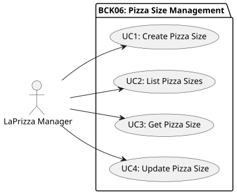

#### Flow Mapping

| User Story | Use Case               | Primary Actor    | Flow Document (SAD)                                               |
| :--------- | :--------------------- | :--------------- | :---------------------------------------------------------------- |
| **BCK06**  | UC1: Create Pizza Size | LaPrizza Manager | [Create Pizza Size](../flows/pizza-size/create-pizza-size.md)     |
| **BCK06**  | UC2: List Pizza Sizes  | LaPrizza Manager | [List Pizza Sizes](../flows/pizza-size/list-search-pizza-size.md) |
| **BCK06**  | UC3: Get Pizza Size    | LaPrizza Manager | [Get Pizza Sizes](../flows/pizza-size/get-pizza-size.md)          |
| **BCK06**  | UC4: Update Pizza Size | LaPrizza Manager | [Update Pizza Size](../flows/pizza-size/update-pizza-size.md)     |

### BCK07: Pizza Component Type Management

#### Flow Mapping

| User Story | Use Case                         | Primary Actor    | Flow Document (SAD)                                                                             |
| :--------- | :------------------------------- | :--------------- | :---------------------------------------------------------------------------------------------- |
| **BCK07**  | UC1: Create Pizza Component Type | LaPrizza Manager | [Create Pizza Component Type](../flows/pizza-component-type/create-pizza-component-type.md)     |
| **BCK07**  | UC2: List Pizza Component Types  | LaPrizza Manager | [List Pizza Component Types](../flows/pizza-component-type/list-search-pizza-component-type.md) |
| **BCK07**  | UC3: Update Pizza Component Type | LaPrizza Manager | [Update Pizza Component Type](../flows/pizza-component-type/update-pizza-component-type.md)     |
| **BCK07**  | UC4: Remove Pizza Component Type | LaPrizza Manager | [Remove Pizza Component Type](../flows/pizza-component-type/remove-pizza-component-type.md)     |

### BCK08: Pizza Component Configuration



#### Flow Mapping

| User Story | Use Case                                  | Primary Actor    | Flow Document (SAD)                                                                                                       |
| :--------- | :---------------------------------------- | :--------------- | :------------------------------------------------------------------------------------------------------------------------ |
| **BCK08**  | UC1: Create Pizza Component Configuration | LaPrizza Manager | [Create Pizza Component Configuration](../flows/pizza-component-configuration/create-component-size-configuration.md)     |
| **BCK08**  | UC2: List Pizza Component Configurations  | LaPrizza Manager | [List Pizza Component Configurations](../flows/pizza-component-configuration/list-search-component-size-configuration.md) |
| **BCK08**  | UC3: Update Pizza Component Configuration | LaPrizza Manager | [Update Pizza Component Configuration](../flows/pizza-component-configuration/update-component-size-configuration.md)     |
| **BCK08**  | UC4: Remove Pizza Component Configuration | LaPrizza Manager | [Remove Pizza Component Configuration](../flows/pizza-component-configuration/remove-component-size-configuration.md)     |

### BCK09: Stock Information Management



#### Flow Mapping

| User Story | Use Case                  | Primary Actor    | Flow Document (SAD)                                       |
| :--------- | :------------------------ | :--------------- | :-------------------------------------------------------- |
| **BCK09**  | UC1: List Product Stock   | LaPrizza Manager | [List Product Stock](../flows/stock/list-search-stock.md) |
| **BCK09**  | UC2: Get Product Stock    | LaPrizza Manager | [Get Product Stock](../flows/stock/get-stock.md)          |
| **BCK09**  | UC3: Adjust Product Stock | LaPrizza Manager | [Adjust Product Stock](../flows/stock/adjust-stock.md)    |

### BCK10: Predefined Pizza Management

#### Flow Mapping

| User Story | Use Case                              | Primary Actor    | Flow Document (SAD)                                                                               |
| :--------- | :------------------------------------ | :--------------- | :------------------------------------------------------------------------------------------------ |
| **BCK10**  | UC1: Define Predefined Pizza          | LaPrizza Manager | [Define Predefined Pizza](../flows/predefined-pizza/define-predefined-pizza.md)                   |
| **BCK10**  | UC2: List Predefined Pizzas           | LaPrizza Manager | [List Predefined Pizzas](../flows/predefined-pizza/list-search-predefined-pizzas.md)              |
| **BCK10**  | UC3: Consult Predefined Pizza by Id   | LaPrizza Manager | [Consult Predefined Pizza by Id](../flows/predefined-pizza/consult-predefined-pizza-by-id.md)     |
| **BCK10**  | UC4: Consult Predefined Pizza by Name | LaPrizza Manager | [Consult Predefined Pizza by Name](../flows/predefined-pizza/consult-predefined-pizza-by-name.md) |
| **BCK10**  | UC5: Update Predefined Pizza          | LaPrizza Manager | [Update Predefined Pizza](../flows/predefined-pizza/update-predefined-pizza.md)                   |
| **BCK10**  | UC6: Deactivate Predefined Pizza      | LaPrizza Manager | [Deactivate Predefined Pizza](../flows/predefined-pizza/deactivate-predefined-pizza.md)           |

### BCK11: Product Catalogue and Product Information

#### Flow Mapping

| User Story | Use Case                    | Primary Actor    | Flow Document (SAD)                                                           |
| :--------- | :-------------------------- | :--------------- | :---------------------------------------------------------------------------- |
| **BCK11**  | UC1: List Product Catalogue | LaPrizza Manager | [List Product Catalogue](../flows/product-catalogue/list-search-catalogue.md) |
| **BCK11**  | UC2: Get Catalogue Item     | LaPrizza Manager | [Get Catalogue Item](../flows/product-catalogue/get-catalogue-item.md)        |

### WEB06: Kitchen Configuration and 3D Integration

The Kitchen Configuration and 3D Integration page lets a Manager import kitchen configurations (dimensions, equipment positions and visual properties), choose the one that is active and keep them up to date. The 3D Visualization Module renders the active configuration, which Managers and Employees can also see on the page. Employees have a read-only view: they can list and consult the configurations and see the viewer, but the page offers no create, edit, activate or delete controls and the API refuses those operations. The accepted JSON format is in [Kitchen Configuration JSON Format](../flows/kitchen-configuration/kitchen-configuration-json-format.md).

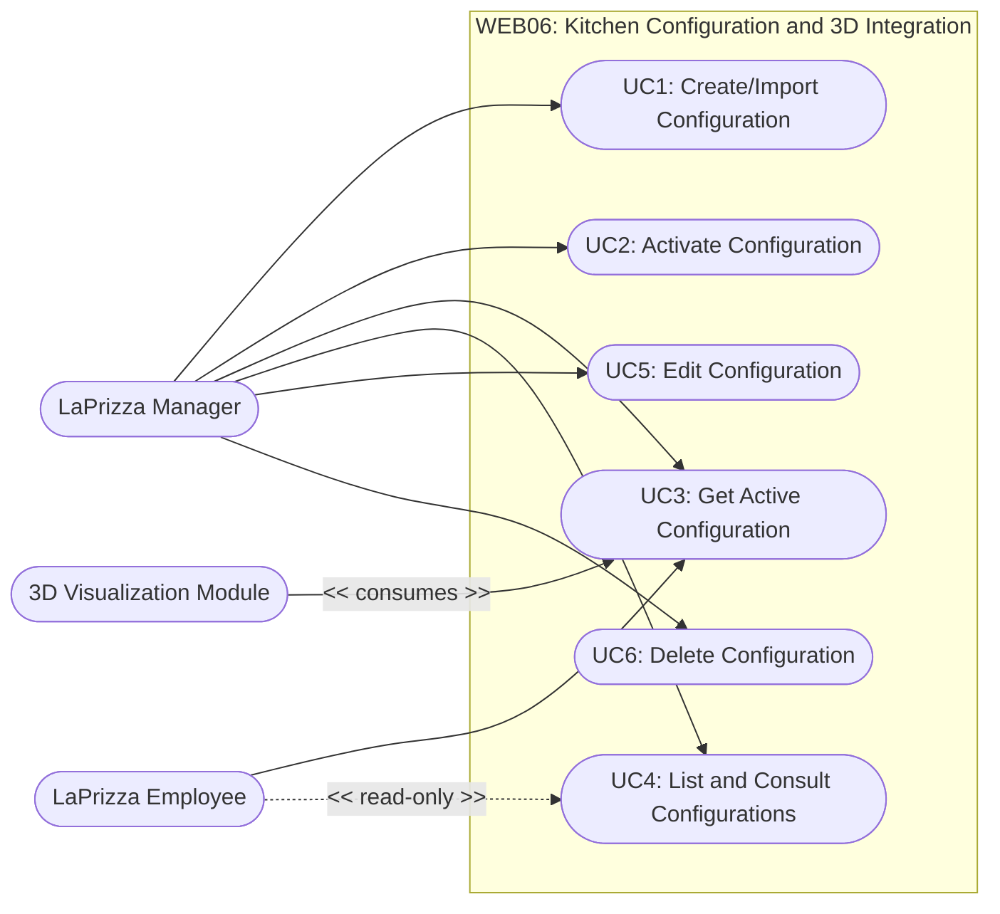
```mermaid
flowchart LR
    Manager([LaPrizza Manager])
    Employee([LaPrizza Employee])
    Viz3D([3D Visualization Module])

    subgraph WEB06 [WEB06: Kitchen Configuration and 3D Integration]
        direction TB
        UC1([UC1: Create/Import Configuration])
        UC2([UC2: Activate Configuration])
        UC3([UC3: Get Active Configuration])
        UC4([UC4: List and Consult Configurations])
        UC5([UC5: Edit Configuration])
        UC6([UC6: Delete Configuration])
    end

    Manager --> UC1
    Manager --> UC2
    Manager --> UC3
    Manager --> UC4
    Manager --> UC5
    Manager --> UC6

    Employee --> UC3
    Employee -.->|<< read-only >>| UC4

    Viz3D -->|<< consumes >>| UC3
```

#### Use Case Descriptions

| Use Case                                 | Primary Actor                                         | Description                                                                                                                                                                                                                                                                                                              | Main Rules                                                                                                                                                                                                                                                                                                                                                                                                               | ADRs                                                                                                                                                                                                                          |
| :--------------------------------------- | :---------------------------------------------------- | :----------------------------------------------------------------------------------------------------------------------------------------------------------------------------------------------------------------------------------------------------------------------------------------------------------------------- | :----------------------------------------------------------------------------------------------------------------------------------------------------------------------------------------------------------------------------------------------------------------------------------------------------------------------------------------------------------------------------------------------------------------------- | :---------------------------------------------------------------------------------------------------------------------------------------------------------------------------------------------------------------------------- |
| **UC1: Create/Import Configuration**     | LaPrizza Manager                                      | Creates a kitchen configuration from a JSON document. On the page, an imported file is read in the browser and loaded into the editor for review; saving sends it as `application/json` to the same endpoint used to create a configuration through the API. A dry-run endpoint validates a document without storing it. | The domain validates the structure with a JSON Schema (valid dimensions, scale limits) and enforces the business invariants (unique equipment ids, asset references that are absolute http(s) URLs or root-relative paths). All violations are returned together, each with its property path. The configuration is stored as a nested BSON object, keeps its assets as self-contained URL/URIs and is created inactive. | [ADR-0020](../adr/0020-strorage-model-of-kitchen-configurations.md), [ADR-0021](../adr/0021-asset-references-strategy.md), [ADR-0022](../adr/0022-content-validation-strategy.md), [ADR-0026](../adr/0026-import-approach.md) |
| **UC2: Activate Configuration**          | LaPrizza Manager                                      | Makes a stored configuration the one in use. The previously active configuration is deactivated.                                                                                                                                                                                                                         | Exactly one configuration is active at a time. The switch is atomic (partial unique index on the active flag and a transaction); concurrent activations answer 409 and activating the already active configuration is a no-op. After the switch, the page reloads the 3D viewer without a full page refresh.                                                                                                             | [ADR-0023](../adr/0023-atomic-activation-strategy.md), [ADR-0027](../adr/0027-viewer-reload-mechanism-in-the-frontend.md)                                                                                                     |
| **UC3: Get Active Configuration**        | LaPrizza Manager / Employee / 3D Visualization Module | Returns the active configuration so that the 3D viewer can render the kitchen.                                                                                                                                                                                                                                           | A dedicated endpoint serves it to the staff roles, and the viewer requests it every time it is mounted. When no configuration is active the answer is 404, the viewer shows an empty state and no hardcoded fallback layout is returned. The payload is self-sufficient, so assets are loaded directly from their URL/URIs.                                                                                              | [ADR-0021](../adr/0021-asset-references-strategy.md), [ADR-0025](../adr/0025-active-configuration-endpoint-and-no-fallback-policy.md)                                                                                         |
| **UC4: List and Consult Configurations** | LaPrizza Manager / Employee                           | Lists the stored configurations, showing which one is active, and consults one of them (name and JSON content).                                                                                                                                                                                                          | Read-only for the Employee: the page hides the Create, Edit, Activate and Delete controls.                                                                                                                                                                                                                                                                                                                               | [ADR-0025](../adr/0025-active-configuration-endpoint-and-no-fallback-policy.md)                                                                                                                                               |
| **UC5: Edit Configuration**              | LaPrizza Manager                                      | Changes the content of a stored configuration, including the active one.                                                                                                                                                                                                                                                 | An edit is validated again with the same rules as the creation. Editing the active configuration is allowed if the new content passes all validations, and the page then remounts the viewer so that it fetches the updated layout.                                                                                                                                                                                      | [ADR-0022](../adr/0022-content-validation-strategy.md), [ADR-0024](../adr/0024-rules-for-editing-and-deleting-the-active-configuration.md), [ADR-0027](../adr/0027-viewer-reload-mechanism-in-the-frontend.md)                |
| **UC6: Delete Configuration**            | LaPrizza Manager                                      | Removes a stored configuration.                                                                                                                                                                                                                                                                                          | The active configuration cannot be deleted (409), and the page does not offer the Delete button for it, so that the viewer never ends up without a configuration.                                                                                                                                                                                                                                                        | [ADR-0024](../adr/0024-rules-for-editing-and-deleting-the-active-configuration.md)                                                                                                                                            |

#### Flow Mapping

| User Story | Use Case                             | Primary Actor                                         | Flow Document (SAD)                                                                                            |
| :--------- | :----------------------------------- | :---------------------------------------------------- | :------------------------------------------------------------------------------------------------------------- | --- |
| **WEB06**  | UC1: Create/Import Configuration     | LaPrizza Manager                                      | [Create / Import Kitchen Configuration](../flows/kitchen-configuration/create-import-kitchen-configuration.md) |
| **WEB06**  | UC2: Activate Configuration          | LaPrizza Manager                                      | [Activate Kitchen Configuration](../flows/kitchen-configuration/activate-kitchen-configuration.md)             |
| **WEB06**  | UC3: Get Active Configuration        | LaPrizza Manager / Employee / 3D Visualization Module | [Get Active Kitchen Configuration](../flows/kitchen-configuration/get-active-kitchen-configuration.md)         |
| **WEB06**  | UC4: List and Consult Configurations | LaPrizza Manager / Employee                           | [List and Consult Configurations](../flows/kitchen-configuration/list-and-consult-configurations.md)           |     |
| **WEB06**  | UC5: Edit Configuration              | LaPrizza Manager                                      | [Edit Configuration](../flows/kitchen-configuration/edit-configuration.md)                                     |
| **WEB06**  | UC6: Delete Configuration            | LaPrizza Manager                                      | [Delete Configuration](../flows/kitchen-configuration/delete-configuration.md)                                 |

The C4 context, container and component views of the feature are in [Kitchen Configuration C4 Views](../flows/kitchen-configuration/c4-views.md).

### WEB07: Artificial Intelligence Configuration and Execution

The AI configuration and execution page lets a Manager prepare the inputs of the requirements planning and run it through the AI Scheduling Module. The Manager creates, consults, edits and deactivates daily product-consumption forecasts, exports the products as JSON, imports a supplier scenario prepared by hand or with an LLM after inspecting it, executes a saved forecast version with a chosen supplier scenario, and consults every saved result together with the versions of the inputs it used. Forecasts and supplier scenarios are immutable and versioned: an edit saves the next version and a delete is a deactivation, so earlier results keep their meaning. Every calculation is a simulation: it never changes the stored stock nor creates purchase orders. The page and all its endpoints are restricted to the Manager: the back end checks a permission on every request (403 otherwise), the route `/ai` requires `planning:execute` and the navigation hides the page from other users. The accepted supplier JSON format is in [Supplier Scenario JSON Format](../flows/ai-planning/supplier-json-format.md).

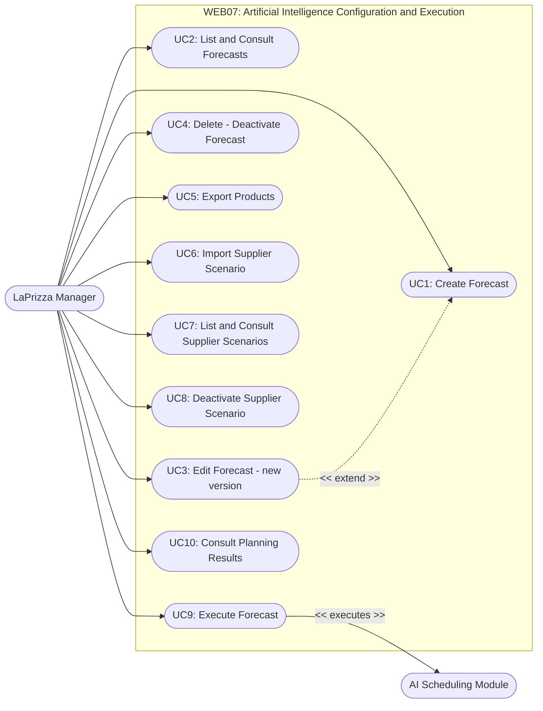
```mermaid
flowchart LR
    Manager([LaPrizza Manager])
    AI([AI Scheduling Module])

    subgraph WEB07 [WEB07: Artificial Intelligence Configuration and Execution]
        direction TB
        UC1([UC1: Create Forecast])
        UC2([UC2: List and Consult Forecasts])
        UC3([UC3: Edit Forecast - new version])
        UC4([UC4: Delete - Deactivate Forecast])
        UC5([UC5: Export Products])
        UC6([UC6: Import Supplier Scenario])
        UC7([UC7: List and Consult Supplier Scenarios])
        UC8([UC8: Deactivate Supplier Scenario])
        UC9([UC9: Execute Forecast])
        UC10([UC10: Consult Planning Results])
    end

    Manager --> UC1
    Manager --> UC2
    Manager --> UC3
    Manager --> UC4
    Manager --> UC5
    Manager --> UC6
    Manager --> UC7
    Manager --> UC8
    Manager --> UC9
    Manager --> UC10

    UC3 -.->|<< extend >>| UC1
    UC9 -->|<< executes >>| AI
```

#### Use Case Descriptions

| Use Case                                     | Primary Actor    | Description                                                                                                                                                                                                                                                                                | Main Rules                                                                                                                                                                                                                                                                                                                                                                                                                                                                                                             | ADRs                                                                                                                                                                   |
| :------------------------------------------- | :--------------- | :----------------------------------------------------------------------------------------------------------------------------------------------------------------------------------------------------------------------------------------------------------------------------------------- | :--------------------------------------------------------------------------------------------------------------------------------------------------------------------------------------------------------------------------------------------------------------------------------------------------------------------------------------------------------------------------------------------------------------------------------------------------------------------------------------------------------------------- | :--------------------------------------------------------------------------------------------------------------------------------------------------------------------- |
| **UC1: Create Forecast**                     | LaPrizza Manager | Creates a forecast: name, period (start and end dates) and daily entries (date, sellable product, size when the product is a pizza, quantity). The page checks the form with the same rules as the back end before sending it.                                                             | Quantities are non-negative integers and omitted entries mean zero consumption. Every rule is checked and all problems are returned together: real dates, end not before start, at least one entry, dates inside the period, known and sellable product, size required for a predefined pizza and only one of its sizes, no size for other products, no duplicate date/product/size. The back end assigns the version (1, or the next one of the same name, ignoring case); a `version` sent by the client is ignored. | [ADR-0033](../adr/0033-immutable-versioned-forecasts-and-supplier-scenarios.md), [ADR-0005](../adr/0005-contract-first-rest-api.md)                                    |
| **UC2: List and Consult Forecasts**          | LaPrizza Manager | Lists the active forecasts, grouped by name with every active version (newest first, tagged "Latest"), and shows one version with its entries, totals and the "omitted entries mean zero" note.                                                                                            | Only active versions are listed or returned; a deactivated or unknown id answers 404. The page builds the detail from the list; `GET /forecasts/{id}` is available through the API.                                                                                                                                                                                                                                                                                                                                    | [ADR-0033](../adr/0033-immutable-versioned-forecasts-and-supplier-scenarios.md)                                                                                        |
| **UC3: Edit Forecast (new version)**         | LaPrizza Manager | Opens the editor prefilled with an existing version and saves the changes as the next version of the same name.                                                                                                                                                                            | The name is read-only in the editor. Saving is a `POST` with the same name and the same rules as UC1; the edited version is never changed, so the results calculated with it stay linked to it.                                                                                                                                                                                                                                                                                                                        | [ADR-0033](../adr/0033-immutable-versioned-forecasts-and-supplier-scenarios.md), [ADR-0034](../adr/0034-recording-planning-runs-with-their-input-versions.md)          |
| **UC4: Delete (Deactivate) Forecast**        | LaPrizza Manager | Removes a forecast version from the list after a confirmation dialog.                                                                                                                                                                                                                      | Soft delete: only `{ "isActive": false }` is accepted. The document stays in the database, the saved results keep its reference, its version number is never reused, and it can no longer be chosen for a new execution.                                                                                                                                                                                                                                                                                               | [ADR-0033](../adr/0033-immutable-versioned-forecasts-and-supplier-scenarios.md)                                                                                        |
| **UC5: Export Products**                     | LaPrizza Manager | Downloads the products that can be bought as a JSON file, the input to prepare the supplier file manually or with an LLM.                                                                                                                                                                  | Includes raw materials, purchased aggregates and stock-controlled products sold directly; excludes produced aggregates and products without stock control (pizzas). Each product has its id, name, kind and the abstract stock unit; the selling price is optional and never excludes a product. Always a fresh export.                                                                                                                                                                                                | [ADR-0035](../adr/0035-supplier-import-with-client-side-checks-and-server-dry-run.md)                                                                                  |
| **UC6: Import Supplier Scenario**            | LaPrizza Manager | Pastes or loads a supplier JSON file, inspects it (parse, local checks and a server dry-run that stores nothing), reviews the preview and confirms to save it.                                                                                                                             | Suppliers with unique ids (name optional); products that exist, each listed once, with offers from listed suppliers, at most one per supplier; offer price in EUR ≥ 0, positive integer stock units, lead time in days ≥ 0, optional supply limit. Missing fields and invalid values are rejected with their path. A rejected file saves nothing, so the previous scenario stays in use. Saved offers are always marked simulated. Versioned like the forecasts.                                                       | [ADR-0033](../adr/0033-immutable-versioned-forecasts-and-supplier-scenarios.md), [ADR-0035](../adr/0035-supplier-import-with-client-side-checks-and-server-dry-run.md) |
| **UC7: List and Consult Supplier Scenarios** | LaPrizza Manager | Lists the active supplier scenarios and shows the offers of one.                                                                                                                                                                                                                           | Products without offers, or exported products missing from the scenario, are shown as "No configured supplier"; every offer is tagged "Simulated".                                                                                                                                                                                                                                                                                                                                                                     | [ADR-0033](../adr/0033-immutable-versioned-forecasts-and-supplier-scenarios.md)                                                                                        |
| **UC8: Deactivate Supplier Scenario**        | LaPrizza Manager | Removes a supplier scenario version from the list after a confirmation dialog.                                                                                                                                                                                                             | Same soft delete as UC4. Saved results keep their reference; the scenario is no longer the default for new executions.                                                                                                                                                                                                                                                                                                                                                                                                 | [ADR-0033](../adr/0033-immutable-versioned-forecasts-and-supplier-scenarios.md)                                                                                        |
| **UC9: Execute Forecast**                    | LaPrizza Manager | Runs the requirements planning of a chosen forecast version with a chosen supplier scenario (by default the latest active ones) and shows daily needs, production, replenishment by product, the daily purchase plan with suppliers and expected delivery dates, unmet needs and warnings. | The back end builds the input snapshot (catalogue and BOM, stock, AI scenario, forecast, supplier scenario) and calls the AI Scheduling Module with a service key. The calculation is synchronous and read-only: stock and the scenario stock are never changed. The page shows progress, sends one request per click and maps each failure to invalid input, missing information or service unavailable. Only a successful calculation is saved as a run.                                                             | [ADR-0034](../adr/0034-recording-planning-runs-with-their-input-versions.md), [ADR-0036](../adr/0036-synchronous-ai-execution-with-duplicate-submission-guard.md)      |
| **UC10: Consult Planning Results**           | LaPrizza Manager | Lists the saved results, optionally for one forecast version, and opens the full plan of one of them.                                                                                                                                                                                      | Each run records the request, the forecast and supplier scenario versions, the snapshot id, the BOM version, the stock source and the full result, taken from the snapshot built by the back end. The list (100 most recent) has no full result; the detail has it.                                                                                                                                                                                                                                                    | [ADR-0034](../adr/0034-recording-planning-runs-with-their-input-versions.md)                                                                                           |

#### Flow Mapping

| User Story | Use Case                                 | Primary Actor    | Flow Document (SAD)                                                                                |
| :--------- | :--------------------------------------- | :--------------- | :------------------------------------------------------------------------------------------------- |
| **WEB07**  | UC1: Create Forecast                     | LaPrizza Manager | [Create Forecast](../flows/ai-planning/create-forecast.md)                                         |
| **WEB07**  | UC2: List and Consult Forecasts          | LaPrizza Manager | [List and Consult Forecasts](../flows/ai-planning/list-and-consult-forecasts.md)                   |
| **WEB07**  | UC3: Edit Forecast (new version)         | LaPrizza Manager | [Edit Forecast](../flows/ai-planning/edit-forecast.md)                                             |
| **WEB07**  | UC4: Delete (Deactivate) Forecast        | LaPrizza Manager | [Deactivate Forecast](../flows/ai-planning/deactivate-forecast.md)                                 |
| **WEB07**  | UC5: Export Products                     | LaPrizza Manager | [Export Products](../flows/ai-planning/export-products.md)                                         |
| **WEB07**  | UC6: Import Supplier Scenario            | LaPrizza Manager | [Import Supplier Scenario](../flows/ai-planning/import-supplier-scenario.md)                       |
| **WEB07**  | UC7: List and Consult Supplier Scenarios | LaPrizza Manager | [List and Consult Supplier Scenarios](../flows/ai-planning/list-and-consult-supplier-scenarios.md) |
| **WEB07**  | UC8: Deactivate Supplier Scenario        | LaPrizza Manager | [Deactivate Supplier Scenario](../flows/ai-planning/deactivate-supplier-scenario.md)               |
| **WEB07**  | UC9: Execute Forecast                    | LaPrizza Manager | [Execute Forecast](../flows/ai-planning/execute-forecast.md)                                       |
| **WEB07**  | UC10: Consult Planning Results           | LaPrizza Manager | [Consult Planning Results](../flows/ai-planning/consult-planning-results.md)                       |

The REST API summary, the business rules and the element catalogue of the feature are in the [AI Planning README](../flows/ai-planning/README.md); the container interactions of the execution are in the Level 2 Process View of [Views](../design/views.md).

### AA01: Local Authentication

A System User signs in with a local account: the e-mail of the account and its password, without an external identity provider. The login page is opened from the **Login** button of the header; once signed in, the header shows the account menu, with **Change password** and **Logout**, and the Change password page also offers **Logout on all devices**. A user who forgot the password asks for a recovery link, receives it by e-mail and sets a new password with it. Local accounts follow the same activation, role, logout and access-control rules as external accounts (AA02): both end in the same session, and roles are always read from the database (AA03). All paths are under `/api/v2`.

The password rules are the same everywhere a password is chosen (AA01, AA07): 8 to 64 characters, with at least one uppercase letter and one of `! @ # $ % ^ & * . , - _ ?`. They are shown on every page where a password is chosen and checked by the back end.

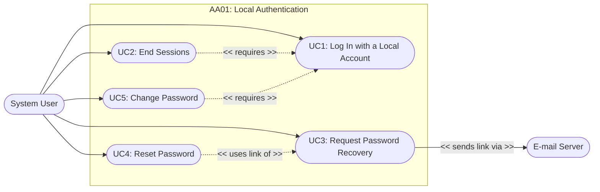
```mermaid
flowchart LR
    User([System User])
    Mail([E-mail Server])

    subgraph AA01 [AA01: Local Authentication]
        direction TB
        UC1([UC1: Log In with a Local Account])
        UC2([UC2: End Sessions])
        UC3([UC3: Request Password Recovery])
        UC4([UC4: Reset Password])
        UC5([UC5: Change Password])
    end

    User --> UC1
    User --> UC2
    User --> UC3
    User --> UC4
    User --> UC5

    UC3 -->|<< sends link via >>| Mail
    UC4 -.->|<< uses link of >>| UC3
    UC2 -.->|<< requires >>| UC1
    UC5 -.->|<< requires >>| UC1
```

#### Use Case Descriptions

| Use Case                             | Primary Actor | Description                                                                                                                                                                          | Main Rules                                                                                                                                                                                                                                                                                                                                                                                                                                                                                                                                                                                                                                                                                                                                                                                                                                                                                                   | ADRs                                                                                                                                                                                                                                                                                                                                                                          |
| :----------------------------------- | :------------ | :----------------------------------------------------------------------------------------------------------------------------------------------------------------------------------- | :----------------------------------------------------------------------------------------------------------------------------------------------------------------------------------------------------------------------------------------------------------------------------------------------------------------------------------------------------------------------------------------------------------------------------------------------------------------------------------------------------------------------------------------------------------------------------------------------------------------------------------------------------------------------------------------------------------------------------------------------------------------------------------------------------------------------------------------------------------------------------------------------------------- | :---------------------------------------------------------------------------------------------------------------------------------------------------------------------------------------------------------------------------------------------------------------------------------------------------------------------------------------------------------------------------- |
| **UC1: Log In with a Local Account** | System User   | Opens the login page from the **Login** button of the header and signs in with the e-mail and the password of the account. On success the user returns to the page that was requested and the header shows the account menu. | The e-mail is normalized (trim, lowercase). An unknown account and a wrong password answer the same `401 INVALID_CREDENTIALS`, and a fictitious Argon2 verification runs for unknown accounts so the time is the same. From the 3rd consecutive failure the account waits 1, 5 and then 30 minutes (`429 TOO_MANY_ATTEMPTS` with `Retry-After`), also for unknown e-mails, which are counted by their hash. Failed attempts are also limited per IP. Only with the correct password does an inactive or disabled account get `403 ACCOUNT_INACTIVE` (the user is told to use the activation invitation) or `403 ACCOUNT_DISABLED`. A successful login reads the roles from the database, creates a session and returns a 60-minute access token kept only in memory, plus a 7-day refresh token in an `HttpOnly`, `Secure`, `SameSite=Strict` cookie. Passwords are stored with Argon2id and never returned. | [ADR-0004](../adr/0004-authentication-and-authorization.md), [ADR-0008](../adr/0008-implement-rate-limiting-policies.md), [ADR-0011](../adr/0011-implement-refresh-tokens-for-secure-sessions.md), [ADR-0032](../adr/0032-secure-session-handling-in-the-api-and-the-spa.md), [ADR-0043](../adr/0043-local-login-without-account-enumeration-and-with-progressive-lockout.md) |
| **UC2: End Sessions**                | System User   | Chooses **Logout** in the account menu of the header (this session), or **Logout on all devices** on the Change password page, after a confirmation.                                 | Logout revokes the session identified by the access token and clears the refresh cookie (`204`). Logout on all devices also increments `tokenVersion` and revokes every session of the user. An ended session is refused on the next request (`401 SESSION_REVOKED`) and its refresh token can no longer be used, even before the access token expires.                                                                                                                                                                                                                                                                                                                                                                                                                                                                                                                                                      | [ADR-0011](../adr/0011-implement-refresh-tokens-for-secure-sessions.md), [ADR-0032](../adr/0032-secure-session-handling-in-the-api-and-the-spa.md)                                                                                                                                                                                                                            |
| **UC3: Request Password Recovery**   | System User   | From the login page, opens "Forgot your password?" and types the e-mail of the account.                                                                                              | Always the same answer (`202`) and the same message, whether the account exists or not; the work is done after the answer. Only active accounts receive the e-mail, with a link to `/reset-password#token=...` valid for 30 minutes. The token is 256 random bits and only its SHA-256 is stored; a new request invalidates the previous links. Passwords are never sent by e-mail. Limited to 3 requests per hour per IP.                                                                                                                                                                                                                                                                                                                                                                                                                                                                                   | [ADR-0008](../adr/0008-implement-rate-limiting-policies.md), [ADR-0044](../adr/0044-password-recovery-with-single-use-hashed-tokens.md), [ADR-0045](../adr/0045-e-mail-delivery-with-nodemailer-and-mailpit.md)                                                                                                                                                               |
| **UC4: Reset Password**              | System User   | Opens the link of the e-mail and chooses a new password with its confirmation.                                                                                                       | The page reads the token from the fragment and removes it from the address bar. The password policy is checked before the link is used, so a weak password does not spend it. The link is used atomically (single use) and expires after 30 minutes; every refusal answers `400 RESET_TOKEN_INVALID`. A reset ends every session of the user and clears the login wait. No session is opened: the user logs in afterwards (UC1).                                                                                                                                                                                                                                                                                                                                                                                                                                                                             | [ADR-0044](../adr/0044-password-recovery-with-single-use-hashed-tokens.md)                                                                                                                                                                                                                                                                                                    |
| **UC5: Change Password**             | System User   | Opens **Change password** in the account menu of the header and types the current password, the new one and its confirmation.                                                        | Requires a session and the current password (`400 CURRENT_PASSWORD_INCORRECT` otherwise, without ending the session). Same password policy as UC4. The current session is kept and every other session of the user is revoked. Failed attempts count in the per-IP login limit.                                                                                                                                                                                                                                                                                                                                                                                                                                                                                                                                                                                                                              | [ADR-0032](../adr/0032-secure-session-handling-in-the-api-and-the-spa.md), [ADR-0044](../adr/0044-password-recovery-with-single-use-hashed-tokens.md)                                                                                                                                                                                                                         |

#### Flow Mapping

| User Story | Use Case                         | Primary Actor | Flow Document (SAD)                                                               |
| :--------- | :------------------------------- | :------------ | :-------------------------------------------------------------------------------- |
| **AA01**   | UC1: Log In with a Local Account | System User   | [Local Login](../flows/authentication/local-login.md)                             |
| **AA01**   | UC2: End Sessions                | System User   | [End Sessions](../flows/authentication/end-sessions.md)                           |
| **AA01**   | UC3: Request Password Recovery   | System User   | [Request Password Recovery](../flows/authentication/request-password-recovery.md) |
| **AA01**   | UC4: Reset Password              | System User   | [Reset Password](../flows/authentication/reset-password.md)                       |
| **AA01**   | UC5: Change Password             | System User   | [Change Password](../flows/authentication/change-password.md)                     |

The REST API summary, the business rules and the element catalogue of the feature are in the [Authentication README](../flows/authentication/README.md). The session renewal, the restore after a reload and the route guard of the SPA are in [Session Handling (AA04)](../flows/authentication/session-handling.md).

### AA07: Secure Account Activation

The activation page lets an invited user complete the activation of an inactive account with the single-use invitation sent by AA06 (`{APP_BASE_URL}/activate#token=...`). The page first checks the link and then shows one of two steps. An account created by an Administrator is a local account: the user chooses its password. An external account is validated by signing in at the identity provider linked to it: since 2026-11-21 the first external login (AA02) creates it active, so this step only concerns older external accounts still waiting for activation, which are activated only if the authenticated identity is the linked one. Activation never opens a session, never changes the roles assigned by AA06 and never grants an optional consent: the user signs in afterwards with the normal login (AA01 or AA02). The page and its endpoints are public, because the account is not active yet; the token of the link is what protects them.

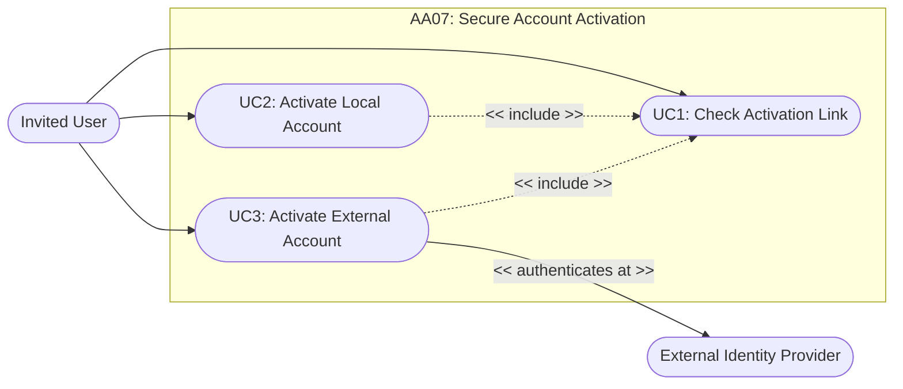
```mermaid
flowchart LR
    User([Invited User])
    IdP([External Identity Provider])

    subgraph AA07 [AA07: Secure Account Activation]
        direction TB
        UC1([UC1: Check Activation Link])
        UC2([UC2: Activate Local Account])
        UC3([UC3: Activate External Account])
    end

    User --> UC1
    User --> UC2
    User --> UC3

    UC2 -.->|<< include >>| UC1
    UC3 -.->|<< include >>| UC1
    UC3 -->|<< authenticates at >>| IdP
```

#### Use Case Descriptions

| Use Case                           | Primary Actor | Description                                                                                                                                                                                                                      | Main Rules                                                                                                                                                                                                                                                                                                                                                                                                                                                                    | ADRs                                                                                                                                                                            |
| :--------------------------------- | :------------ | :------------------------------------------------------------------------------------------------------------------------------------------------------------------------------------------------------------------------------- | :---------------------------------------------------------------------------------------------------------------------------------------------------------------------------------------------------------------------------------------------------------------------------------------------------------------------------------------------------------------------------------------------------------------------------------------------------------------------------- | :------------------------------------------------------------------------------------------------------------------------------------------------------------------------------ |
| **UC1: Check Activation Link**     | Invited User  | Opens the link of the invitation e-mail. The page reads the token from the fragment, removes it from the address bar and asks the back end which step to show, with the masked e-mail of the account and the expiry of the link. | Nothing is used or changed. Unknown, used, replaced or expired links, and accounts that are not waiting for their first activation (active, disabled or activated before), all answer the same `INVITATION_INVALID`, so the answer never tells whether an account exists. Only the hash of the token is looked up. Failed attempts are rate limited per IP.                                                                                                                   | [ADR-0041](../adr/0041-administrator-role-role-change-records-and-activation-invitations.md), [ADR-0042](../adr/0042-account-activation-method-session-and-oidc-transaction.md) |
| **UC2: Activate Local Account**    | Invited User  | Chooses and confirms the password of an account created by an Administrator and activates it.                                                                                                                                    | Same password policy as AA01, checked before the link is used, so a weak password does not spend it. The invitation is used atomically (single use) and the account is activated with a conditional update (only if it is still inactive and was never activated). Only status, activation date, login counters and the password hash change: roles stay as assigned. No session and no cookie: 204, then the normal login. An external account cannot be activated this way. | [ADR-0041](../adr/0041-administrator-role-role-change-records-and-activation-invitations.md), [ADR-0042](../adr/0042-account-activation-method-session-and-oidc-transaction.md) |
| **UC3: Activate External Account** | Invited User  | Presses "Continue with <provider>", signs in at the provider linked to the account and comes back with the account activated.                                                                                                    | The token goes in a form POST, never in a URL. The OIDC transaction cookie keeps the hash of the token and is marked as an activation, so the callback can neither create an account nor open a session. The authenticated identity must have the same issuer and subject as the identity linked to the account; another identity answers `INVITATION_MISMATCH`, leaves the link unused and the account inactive.                                                             | [ADR-0042](../adr/0042-account-activation-method-session-and-oidc-transaction.md)                                                                                               |

#### Flow Mapping

| User Story | Use Case                       | Primary Actor | Flow Document (SAD)                                                                   |
| :--------- | :----------------------------- | :------------ | :------------------------------------------------------------------------------------ |
| **AA07**   | UC1: Check Activation Link     | Invited User  | [Check Activation Link](../flows/account-activation/inspect-activation-link.md)       |
| **AA07**   | UC2: Activate Local Account    | Invited User  | [Activate Local Account](../flows/account-activation/activate-local-account.md)       |
| **AA07**   | UC3: Activate External Account | Invited User  | [Activate External Account](../flows/account-activation/activate-external-account.md) |

The REST API summary, the business rules and the element catalogue of the feature are in the [Account Activation README](../flows/account-activation/README.md).

### VIS05: Scene Lighting

The 3D viewer lights the kitchen so that every object is visible, realistically rendered and easy to read from any viewpoint. The lighting is client-side only: it lives in the 3D Visualization module embedded in the Web Application and needs no endpoint of its own, since the layout comes from the active kitchen configuration (WEB06 UC3). It has five light sources at fixed positions in world space, derived only from the kitchen dimensions and the assembly line placement: an ambient light, a hemisphere light, a directional light that casts shadows, a spotlight over the kitchen that casts shadows and a spotlight over the assembly line. The viewer is shown on the 3D Visualization page and on the Kitchen Configuration page, which require the `kitchen:read` permission (Manager and Employee).

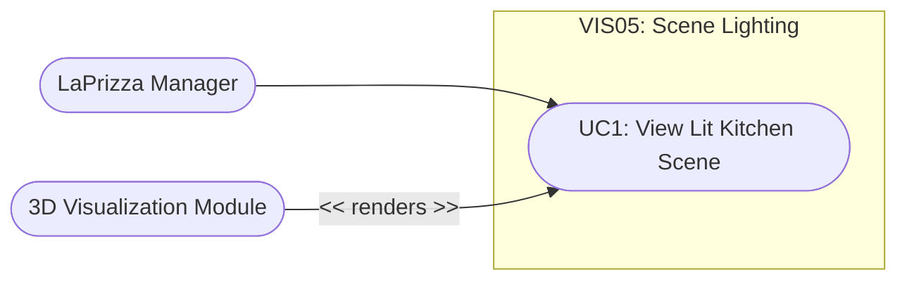
```mermaid
flowchart LR
    Manager([LaPrizza Manager])
    Viz3D([3D Visualization Module])

    subgraph VIS05 [VIS05: Scene Lighting]
        direction TB
        UC1([UC1: View Lit Kitchen Scene])
    end

    Manager --> UC1
    Viz3D -->|<< renders >>| UC1
```

#### Use Case Descriptions

| Use Case                        | Primary Actor               | Description                                                                                                                                                                              | Main Rules                                                                                                                                                                                                                                                                                                                                                                                                                                                                                                                                                                                                                                                                                                                    | ADRs                                                                                                                  |
| :------------------------------ | :-------------------------- | :--------------------------------------------------------------------------------------------------------------------------------------------------------------------------------------- | :---------------------------------------------------------------------------------------------------------------------------------------------------------------------------------------------------------------------------------------------------------------------------------------------------------------------------------------------------------------------------------------------------------------------------------------------------------------------------------------------------------------------------------------------------------------------------------------------------------------------------------------------------------------------------------------------------------------------------- | :-------------------------------------------------------------------------------------------------------------------- |
| **UC1: View Lit Kitchen Scene** | LaPrizza Manager / Employee | When the viewer opens, the active kitchen and its assembly line are rendered with the default lighting and shadows. The Manager orbits and zooms freely and the lighting stays the same. | At least an ambient light and a spotlight: the scene has ambient, hemisphere, directional and two spotlights. Low base light (ambient 0.35, hemisphere 0.45 with a dark ground colour) plus a directional light and spotlights give depth and contours without overexposure or pitch-black faces. Only two lights cast shadows (2048 and 1024 shadow maps), the pixel ratio is capped at 2 and meshes are marked for shadows once, checked every 30 frames. Light positions do not depend on the camera, the shadow frustum is fitted to the room and the orbit controls keep the camera between a minimum and maximum distance and above the floor. Without an active configuration the viewer shows an empty state (WEB06). | [ADR-0030](../adr/0030-adoption-of-r3f-for-3d-module-integration.md), [ADR-0037](../adr/0037-scene-lighting-setup.md) |

#### Flow Mapping

| User Story | Use Case                    | Primary Actor               | Flow Document (SAD)                                                         |
| :--------- | :-------------------------- | :-------------------------- | :-------------------------------------------------------------------------- |
| **VIS05**  | UC1: View Lit Kitchen Scene | LaPrizza Manager / Employee | [View Lit Kitchen Scene](../flows/scene-lighting/view-lit-kitchen-scene.md) |

The light sources, the element catalogue and the notes of the feature are in the [Scene Lighting README](../flows/scene-lighting/README.md).

### VIS06: Interactive Light Controls

The viewer has a lighting panel that lets the user switch each light source on and off and change its colour and intensity, plus the cutoff angle and penumbra of the two spotlights. The panel is built with lil-gui (the build bundled with Three.js), has a title "Lighting", is open by default and sits in the top-right corner of the viewer, with one folder per light source and a Reset button. The light positions stay fixed (VIS05). The settings live only in the browser: they are not stored, call no endpoint and go back to the defaults every time the viewer is mounted. Like the viewer, the panel is shown to every user with the `kitchen:read` permission (Manager).

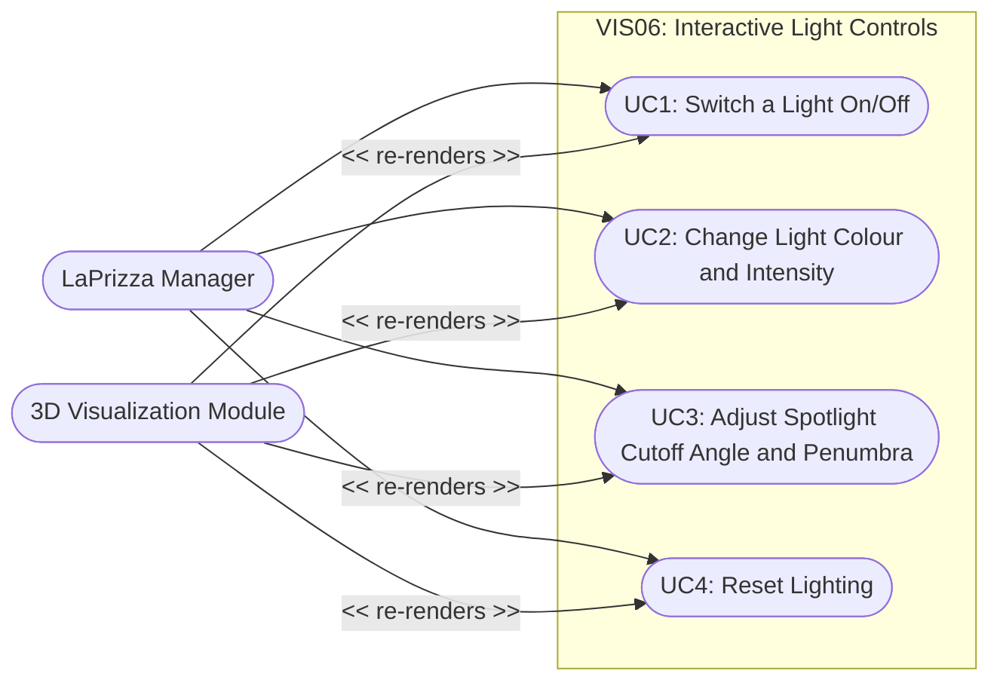
```mermaid
flowchart LR
    Manager([LaPrizza Manager])
    Viz3D([3D Visualization Module])

    subgraph VIS06 [VIS06: Interactive Light Controls]
        direction TB
        UC1([UC1: Switch a Light On/Off])
        UC2([UC2: Change Light Colour and Intensity])
        UC3([UC3: Adjust Spotlight Cutoff Angle and Penumbra])
        UC4([UC4: Reset Lighting])
    end

    Manager --> UC1
    Manager --> UC2
    Manager --> UC3
    Manager --> UC4

    Viz3D -->|<< re-renders >>| UC1
    Viz3D -->|<< re-renders >>| UC2
    Viz3D -->|<< re-renders >>| UC3
    Viz3D -->|<< re-renders >>| UC4
```

#### Use Case Descriptions

| Use Case                                            | Primary Actor               | Description                                                                                           | Main Rules                                                                                                                                                                                                                             | ADRs                                                                                                       |
| :-------------------------------------------------- | :-------------------------- | :---------------------------------------------------------------------------------------------------- | :------------------------------------------------------------------------------------------------------------------------------------------------------------------------------------------------------------------------------------- | :--------------------------------------------------------------------------------------------------------- |
| **UC1: Switch a Light On/Off**                      | LaPrizza Manager / Employee | Switches a light source on or off with the "On" checkbox of its folder.                               | A light that is off stays in the scene with intensity 0 (no shader recompilation), and the other controls of its folder (colour, intensity and, for spotlights, cutoff angle and penumbra) are disabled until it is switched on again. | [ADR-0038](../adr/0038-lighting-controls-with-lil-gui.md), [ADR-0037](../adr/0037-scene-lighting-setup.md) |
| **UC2: Change Light Colour and Intensity**          | LaPrizza Manager / Employee | Changes the colour of a light with a colour picker and its intensity with a slider.                   | Intensity limits per light, step 0.01: ambient and hemisphere 0 to 2, directional 0 to 3, spotlights 0 to 10. The scene is updated on every change.                                                                                    | [ADR-0038](../adr/0038-lighting-controls-with-lil-gui.md)                                                  |
| **UC3: Adjust Spotlight Cutoff Angle and Penumbra** | LaPrizza Manager / Employee | Changes the cutoff angle and the penumbra of the kitchen spotlight or of the assembly line spotlight. | Only in the two spotlight folders. Cutoff angle 5° to 90° (step 1), converted to radians for Three.js; penumbra 0 to 1 (step 0.01).                                                                                                    | [ADR-0038](../adr/0038-lighting-controls-with-lil-gui.md)                                                  |
| **UC4: Reset Lighting**                             | LaPrizza Manager / Employee | Restores the default lighting with the Reset button.                                                  | Every light goes back to `DEFAULT_LIGHTING` (the VIS05 look), every control shows the restored value and the controls are enabled or disabled again according to the on/off state.                                                     | [ADR-0038](../adr/0038-lighting-controls-with-lil-gui.md), [ADR-0037](../adr/0037-scene-lighting-setup.md) |

#### Flow Mapping

| User Story | Use Case                                        | Primary Actor               | Flow Document (SAD)                                                                                          |
| :--------- | :---------------------------------------------- | :-------------------------- | :----------------------------------------------------------------------------------------------------------- |
| **VIS06**  | UC1: Switch a Light On/Off                      | LaPrizza Manager / Employee | [Switch a Light On/Off](../flows/scene-lighting/switch-light-on-off.md)                                      |
| **VIS06**  | UC2: Change Light Colour and Intensity          | LaPrizza Manager / Employee | [Change Light Colour and Intensity](../flows/scene-lighting/change-light-colour-and-intensity.md)            |
| **VIS06**  | UC3: Adjust Spotlight Cutoff Angle and Penumbra | LaPrizza Manager / Employee | [Adjust Spotlight Cutoff Angle and Penumbra](../flows/scene-lighting/adjust-spotlight-angle-and-penumbra.md) |
| **VIS06**  | UC4: Reset Lighting                             | LaPrizza Manager / Employee | [Reset Lighting](../flows/scene-lighting/reset-lighting.md)                                                  |

The light sources, the GUI controls, the element catalogue and the notes of the feature are in the [Scene Lighting README](../flows/scene-lighting/README.md).

### AI06: Back-End Data and Prolog Knowledge Base

The AI Scheduling Module obtains the business data it needs from the back end, never from the database. There is a single data contract, the planning snapshot of `GET /ai-data/snapshot`, built by the back end from the catalogue and pizza BOM, the stock, the AI scenario (simulated orders and, optionally, its own stock), the forecast and the supplier scenario confirmed in WEB07. Each snapshot records the selected scenario and the origin and version or retrieval time of every input. The snapshot reaches the Prolog service in two ways: in the main path (AI05, used by the Web Application) the back end builds it and sends it in the body of `POST /service/{bom,requirements}` with a service key; in the alternative path the service fetches it itself with the Manager's token when it is called directly on `POST /bom` or `POST /requirements`. In both, the snapshot is validated and loaded as facts for one calculation only, and the facts are removed afterwards. Calculations only read: stock and purchase orders are owned by the back end and are never changed.

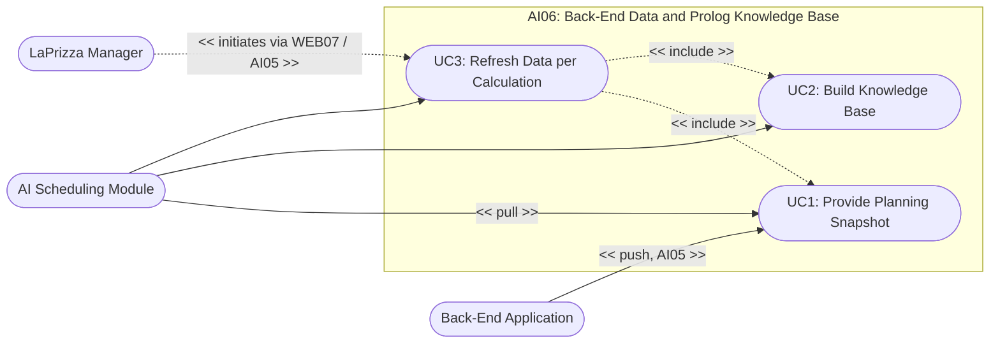
```mermaid
flowchart LR
    AI([AI Scheduling Module])
    BE([Back-End Application])
    Manager([LaPrizza Manager])

    subgraph AI06 [AI06: Back-End Data and Prolog Knowledge Base]
        direction TB
        UC1([UC1: Provide Planning Snapshot])
        UC2([UC2: Build Knowledge Base])
        UC3([UC3: Refresh Data per Calculation])
    end

    AI -->|<< pull >>| UC1
    BE -->|<< push, AI05 >>| UC1
    AI --> UC2
    AI --> UC3
    UC3 -.->|<< include >>| UC1
    UC3 -.->|<< include >>| UC2
    Manager -.->|<< initiates via WEB07 / AI05 >>| UC3
```

#### Use Case Descriptions

| Use Case                              | Primary Actor                                             | Description                                                                                                                                                                                                                                                                      | Main Rules                                                                                                                                                                                                                                                                                                                                                                                                                                                                                    | ADRs                                                                                                                                                    |
| :------------------------------------ | :-------------------------------------------------------- | :------------------------------------------------------------------------------------------------------------------------------------------------------------------------------------------------------------------------------------------------------------------------------- | :-------------------------------------------------------------------------------------------------------------------------------------------------------------------------------------------------------------------------------------------------------------------------------------------------------------------------------------------------------------------------------------------------------------------------------------------------------------------------------------------- | :------------------------------------------------------------------------------------------------------------------------------------------------------ |
| **UC1: Provide Planning Snapshot**    | AI Scheduling Module (pull) / Back-End Application (push) | Returns the planning data of the selected AI scenario and stock mode as one JSON document: products, sizes, pizza BOM per size, aggregates with their classification and composition, pizzas and sizes, stock, simulated orders, forecast, supplier scenario, issues and `meta`. | Authorized access only (`planning:execute`, Manager); no customer data. Quantities in abstract stock units. Missing or invalid BOM consumptions and stock rows are reported in `issues`, never defaulted. `meta` records the snapshot id (hash of the content), one retrieval time and the source and version of the catalogue, stock, orders, forecast and supplier scenario; a snapshot with a scenario is a simulation. Unknown scenario 404, scenario stock missing in scenario mode 400. | [ADR-0039](../adr/0039-planning-snapshot-as-the-data-contract-with-the-ai-service.md), [ADR-0005](../adr/0005-contract-first-rest-api.md)               |
| **UC2: Build Knowledge Base**         | AI Scheduling Module                                      | Validates the snapshot and turns it into Prolog facts with the business identifiers of the back end (products, sizes, BOM, aggregates, stock, orders, forecast, suppliers and offers).                                                                                           | Every problem is collected (missing fields, invalid quantities, duplicates, unknown references, stock of products without stock control, incomplete or nested aggregates, pizzas used as components, purchased aggregates with a composition, invalid forecast or supplier data). With any problem nothing is loaded and the answer is 422 `AI_INVALID_DATA`. Each offer keeps its product, price in EUR, quoted stock units and lead time; a supply limit exists only when given.            | [ADR-0040](../adr/0040-knowledge-base-loaded-per-calculation.md)                                                                                        |
| **UC3: Refresh Data per Calculation** | AI Scheduling Module                                      | Every calculation uses a snapshot obtained for it, loads it, calculates and clears the knowledge base.                                                                                                                                                                           | The snapshot with a scenario is never cached. Loading is serialized (mutex) and done in one transaction, and the facts are always removed at the end, so two calculations never mix versions. If the back end does not answer, the calculation fails (503 or 504) and nothing is calculated with older data.                                                                                                                                                                                  | [ADR-0039](../adr/0039-planning-snapshot-as-the-data-contract-with-the-ai-service.md), [ADR-0040](../adr/0040-knowledge-base-loaded-per-calculation.md) |

#### Flow Mapping

| User Story | Use Case                          | Primary Actor                               | Flow Document (SAD)                                                                   |
| :--------- | :-------------------------------- | :------------------------------------------ | :------------------------------------------------------------------------------------ |
| **AI06**   | UC1: Provide Planning Snapshot    | AI Scheduling Module / Back-End Application | [Provide Planning Snapshot](../flows/ai-knowledge-base/provide-planning-snapshot.md)  |
| **AI06**   | UC2: Build Knowledge Base         | AI Scheduling Module                        | [Build Knowledge Base](../flows/ai-knowledge-base/build-knowledge-base.md)            |
| **AI06**   | UC3: Refresh Data per Calculation | AI Scheduling Module                        | [Refresh Data per Calculation](../flows/ai-knowledge-base/refresh-per-calculation.md) |

The REST API summary, the snapshot format, the facts of the knowledge base and the element catalogue are in the [AI Knowledge Base README](../flows/ai-knowledge-base/README.md).

### WEB04: User Feedback and Validation

Every page of the Web Application gives the same kind of feedback: it says when something is loading, confirms what was saved, explains what is wrong in a form and how to fix it, asks before actions with significant consequences, and lets the user retry a failed request. These behaviours are shared components of the SPA, so every feature uses them in the same way; the back end remains the authority for every rule and answers with structured, translatable errors that never carry internal details.

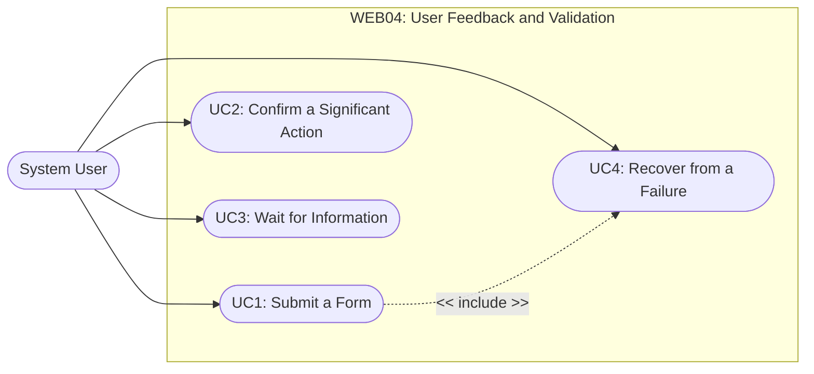
```mermaid
flowchart LR
    User([System User])

    subgraph WEB04 [WEB04: User Feedback and Validation]
        direction TB
        UC1([UC1: Submit a Form])
        UC2([UC2: Confirm a Significant Action])
        UC3([UC3: Wait for Information])
        UC4([UC4: Recover from a Failure])
    end

    User --> UC1
    User --> UC2
    User --> UC3
    User --> UC4
    UC1 -.->|<< include >>| UC4
```

#### Use Case Descriptions

| Use Case | Primary Actor | Description | Main Rules | ADRs |
| :------- | :------------ | :---------- | :--------- | :--- |
| **UC1: Submit a Form** | System User | Fills a form and saves it. | Rules are checked in the browser first (`validators.js`) and again by the API (Joi and domain). Each violation is shown on its field and in a summary with links to the fields; the text explains how to correct it (e.g. the password policy, the name rule, the stock limits). A second submission is ignored while one is running (`useSubmit`, submit guard). On failure the inputs keep their values; success is confirmed by a toast that closes after 3 s. | [ADR-0018](../adr/0018-internationalization-of-the-web-application-(english-and-portuguese).md), [ADR-0043](../adr/0043-ui-consistency-and-input-validation-after-the-sprint-2-review.md) |
| **UC2: Confirm a Significant Action** | System User | Deactivates, deletes, removes stock or enters an unusual quantity. | A confirmation dialog (`useConfirm`) states what will happen before the request is sent; stock movements of 1000 units or more show the change (from → to). | [ADR-0043](../adr/0043-ui-consistency-and-input-validation-after-the-sprint-2-review.md) |
| **UC3: Wait for Information** | System User | Opens a page or a list. | A global progress bar follows the pending requests; pages and lists show a placeholder that keeps the room of the content, so the layout does not move when the data arrives. | [ADR-0043](../adr/0043-ui-consistency-and-input-validation-after-the-sprint-2-review.md) |
| **UC4: Recover from a Failure** | System User | A request fails (network, timeout, server error). | Errors are normalized by kind and translated by code (`error-normalizer.js`, `error-text.js`); messages never show server text, stack traces or session data; 5xx answers carry no details. Lists offer "Retry"; a failed operation is never shown as completed. | [ADR-0043](../adr/0043-ui-consistency-and-input-validation-after-the-sprint-2-review.md) |

#### Flow Mapping

| User Story | Use Case | Primary Actor | Flow Document (SAD) |
| :--------- | :------- | :------------ | :------------------ |
| **WEB04**  | UC1-UC4 | System User | Client-side behaviour, no flow of its own. Examples in the feature flows: [Adjust Stock](../flows/stock/adjust-stock.md), [Kitchen Configuration JSON Format](../flows/kitchen-configuration/kitchen-configuration-json-format.md#errors-in-the-editor-web04), [Customer](../flows/customer/README.md) |

Evidence: `submit-guard.test.js`, `validators.test.js`, `name-rules.test.js`, `feedback-store.test.js`, `confirm-store.test.js`, `error-normalizer.test.js`, `error-text.test.js`, `http-client-feedback.test.js`, `stock-rules.test.js`, `json-locations.test.js` (front end); `error-handler.test.js` (back end).

### AA02: External Identity Provider Integration

A user can sign in with Google or Microsoft (OpenID Connect, Authorization Code with PKCE) besides the local login. The first external login of a verified e-mail creates an active account with the `CUSTOMER` role and opens the session; a returning identity signs in to its account. The provider password never reaches LaPrizza, and an e-mail that already belongs to another account is never linked automatically. When the provider does not supply a phone number, it is asked before the customer features are available.

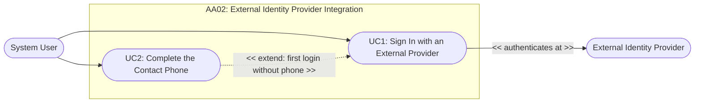
```mermaid
flowchart LR
    User([System User])
    IdP([External Identity Provider])

    subgraph AA02 [AA02: External Identity Provider Integration]
        direction TB
        UC1([UC1: Sign In with an External Provider])
        UC2([UC2: Complete the Contact Phone])
    end

    User --> UC1
    User --> UC2
    UC1 -->|<< authenticates at >>| IdP
    UC2 -.->|<< extend: first login without phone >>| UC1
```

#### Use Case Descriptions

| Use Case | Primary Actor | Description | Main Rules | ADRs |
| :------- | :------------ | :---------- | :--------- | :--- |
| **UC1: Sign In with an External Provider** | System User | Presses "Continue with <provider>", authenticates at the provider and returns to the application signed in. | Only enabled providers are shown. `state`, `nonce` and PKCE in a signed transaction cookie; the ID token is validated by the library; the identity is `(issuer, sub)`. New identity: a verified, unused e-mail creates an active `CUSTOMER` account (if the identity link fails, the account is removed); an e-mail of another account is refused (`ACCOUNT_LINK_REQUIRED`). A never-activated linked account is activated by the login; disabled accounts are refused. Cancelled or failed logins show a translated code and grant nothing. The session is the same as the local one (AA04). | [ADR-0044](../adr/0044-external-authentication-with-openid-connect.md), [ADR-0045](../adr/0045-external-identity-model-and-account-resolution.md), [ADR-0042](../adr/0042-account-activation-method-session-and-oidc-transaction.md) |
| **UC2: Complete the Contact Phone** | System User | After the first external login, enters the phone number before using the customer pages. | `phoneRequired` in the session user while a `CUSTOMER` has neither a phone nor a Customer record; the back end withholds the customer permissions until then. Portuguese number, stored normalized (`PUT /auth/me/phone`). | [ADR-0045](../adr/0045-external-identity-model-and-account-resolution.md) |

#### Flow Mapping

| User Story | Use Case | Primary Actor | Flow Document (SAD) |
| :--------- | :------- | :------------ | :------------------ |
| **AA02**   | UC1: Sign In with an External Provider | System User | [External Authentication](../flows/authentication/external-authentication.md#diagrams) |
| **AA02**   | UC2: Complete the Contact Phone | System User | [External Authentication - Contact phone](../flows/authentication/external-authentication.md#contact-phone-after-the-first-external-login) |

### AA04: Secure Session Handling

A signed-in user keeps working while the session is valid: the session survives a reload or a new tab of the same browser, expires after 7 days or 30 minutes without use, is checked on every protected request and ends everywhere it is shared when the user logs out. Local and external logins create the same kind of session.

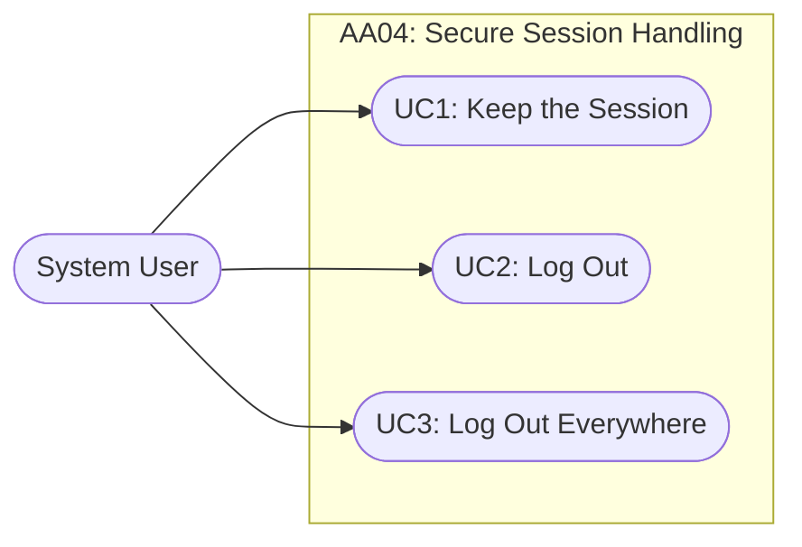
```mermaid
flowchart LR
    User([System User])

    subgraph AA04 [AA04: Secure Session Handling]
        direction TB
        UC1([UC1: Keep the Session])
        UC2([UC2: Log Out])
        UC3([UC3: Log Out Everywhere])
    end

    User --> UC1
    User --> UC2
    User --> UC3
```

#### Use Case Descriptions

| Use Case | Primary Actor | Description | Main Rules | ADRs |
| :------- | :------------ | :---------- | :--------- | :--- |
| **UC1: Keep the Session** | System User | Works in the application, reloads the page or opens a new tab. | Access token (60 min) only in memory; rotating refresh token in an `HttpOnly`, `Secure`, `SameSite=Strict` cookie restores it after a reload. Every request re-checks the user, the token version and the session (absolute and idle expiry). Refreshes are serialized across tabs (Web Lock). HTTPS outside `localhost`. | [ADR-0011](../adr/0011-implement-refresh-tokens-for-secure-sessions.md), [ADR-0032](../adr/0032-secure-session-handling-in-the-api-and-the-spa.md) |
| **UC2: Log Out** | System User | Logs out in one tab. | The session is revoked and the cookie cleared; the other tabs of the same browser end too (`BroadcastChannel`, and the server refuses their token); other browsers keep their own sessions. Cached data is cleared and pages restored from the back/forward cache are reloaded. | [ADR-0032](../adr/0032-secure-session-handling-in-the-api-and-the-spa.md) |
| **UC3: Log Out Everywhere** | System User | Ends every session of the account. | `tokenVersion` incremented and all sessions revoked. | [ADR-0032](../adr/0032-secure-session-handling-in-the-api-and-the-spa.md) |

#### Flow Mapping

| User Story | Use Case | Primary Actor | Flow Document (SAD) |
| :--------- | :------- | :------------ | :------------------ |
| **AA04**   | UC1: Keep the Session | System User | [Session Handling - Protected request and renewal, Restoring the session after a reload](../flows/authentication/session-handling.md#diagrams) |
| **AA04**   | UC2: Log Out | System User | [Session Handling - Logout and other tabs](../flows/authentication/session-handling.md#logout-and-other-tabs) |
| **AA04**   | UC3: Log Out Everywhere | System User | [Session Handling - Session invalidation rules](../flows/authentication/session-handling.md#session-invalidation-rules) |

### VIS01: 3D Module Integration

The 3D viewer is a React Three Fiber component (Three.js) of the SPA, in `frontend/src/features/visualization3d`. It is a lazy-loaded feature of the registry, rendered inside the common layout (header, menu, breadcrumbs) and protected by the same session and permissions as the other pages: `kitchen:read` (Manager and Employee). It is shown on the 3D Visualization page and on the Kitchen Configuration page.

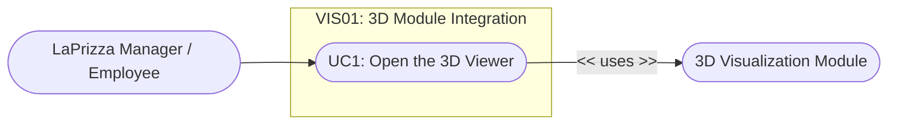
```mermaid
flowchart LR
    Staff([LaPrizza Manager / Employee])
    Viz3D([3D Visualization Module])

    subgraph VIS01 [VIS01: 3D Module Integration]
        direction TB
        UC1([UC1: Open the 3D Viewer])
    end

    Staff --> UC1
    UC1 -->|<< uses >>| Viz3D
```

#### Use Case Descriptions

| Use Case | Primary Actor | Description | Main Rules | ADRs |
| :------- | :------------ | :---------- | :--------- | :--- |
| **UC1: Open the 3D Viewer** | LaPrizza Manager / Employee | Opens the 3D Visualization page (or the Kitchen Configuration page) and sees the active kitchen. | Same navigation, layout, language and session as the rest of the SPA; the route guard and the API both require `kitchen:read`. The viewer fetches the active configuration every time it is mounted and shows an empty state when none is active. | [ADR-0007](../adr/0007-web-application-(spa)-technology-and-structure.md), [ADR-0030](../adr/0030-adoption-of-r3f-for-3d-module-integration.md), [ADR-0027](../adr/0027-viewer-reload-mechanism-in-the-frontend.md) |

#### Flow Mapping

| User Story | Use Case | Primary Actor | Flow Document (SAD) |
| :--------- | :------- | :------------ | :------------------ |
| **VIS01**  | UC1: Open the 3D Viewer | LaPrizza Manager / Employee | [Get Active Kitchen Configuration](../flows/kitchen-configuration/get-active-kitchen-configuration.md) |

### VIS02: Kitchen Layout and Equipment

The viewer draws the kitchen of the active configuration: the floor with its dimensions and texture, every element at its position, rotation (degrees) and scale, and the assembly line at its placement (VIS03). Everything comes from the back end as JSON; no layout is embedded in the SPA.

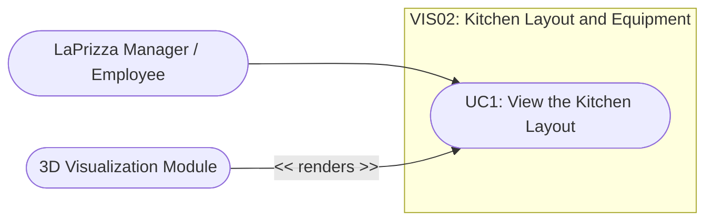
```mermaid
flowchart LR
    Staff([LaPrizza Manager / Employee])
    Viz3D([3D Visualization Module])

    subgraph VIS02 [VIS02: Kitchen Layout and Equipment]
        direction TB
        UC1([UC1: View the Kitchen Layout])
    end

    Staff --> UC1
    Viz3D -->|<< renders >>| UC1
```

#### Use Case Descriptions

| Use Case | Primary Actor | Description | Main Rules | ADRs |
| :------- | :------------ | :---------- | :--------- | :--- |
| **UC1: View the Kitchen Layout** | LaPrizza Manager / Employee | Sees the kitchen of the active configuration in 3D. | Dimensions, positions, orientations, scales, materials and model references come from `GET /kitchen-configurations/active`. Elements are drawn procedurally by type (`equipment`: stone/dome wood-fired oven; other types: a box) inside the kitchen bounds checked by the back end. | [ADR-0020](../adr/0020-strorage-model-of-kitchen-configurations.md), [ADR-0021](../adr/0021-asset-references-strategy.md), [ADR-0025](../adr/0025-active-configuration-endpoint-and-no-fallback-policy.md) |

Known gaps (Sprint 2 review): `modelReference` is validated and stored but the viewer does not load imported models yet (the `Model` component of `kitchen-scene.jsx` is not used), and only the oven has a procedural model; tables, counters, fryer, griddle, grill, refrigerator, dishwasher, exhaust hood and cooking tools are drawn as boxes.

#### Flow Mapping

| User Story | Use Case | Primary Actor | Flow Document (SAD) |
| :--------- | :------- | :------------ | :------------------ |
| **VIS02**  | UC1: View the Kitchen Layout | LaPrizza Manager / Employee | [Get Active Kitchen Configuration](../flows/kitchen-configuration/get-active-kitchen-configuration.md), [JSON Format](../flows/kitchen-configuration/kitchen-configuration-json-format.md) |
